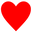
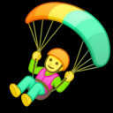
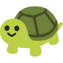

# 🕶️

This is a quarantine of some extremely bright PNG files. They render brightest on Chrome-based tools with MacBook Pro screens.

⚠️  Do not upload these to your company Slack ⚠️

⚠️  Do not create your own HDR emojis ⚠️

⚠️  Do not dazzle your coworkers ⚠️


# Turning HDR images off

## Slack

If you know how to use the Terminal, run this to restart Slack without any HDR emojis:

```
killall Slack ; open /Applications/Slack.app/ --args --force-color-profile=srgb
```

(HDR emojis will return the next time you relaunch Slack.)

## Chrome

It's the same as above, though I needed to delay relaunching for some reason.

```
killall 'Google Chrome' ; sleep 3 ; open /Applications/Google\ Chrome.app/ --args --force-color-profile=srgb
```

HDR emojis will return the next time you relaunch Chrome. To permanently turn off HDR images in Chrome, paste this address in your browser's address bar:

```
chrome://flags/#force-color-profile
```

Set the **Force color profile** setting to **sRGB**.

# Quarantine











